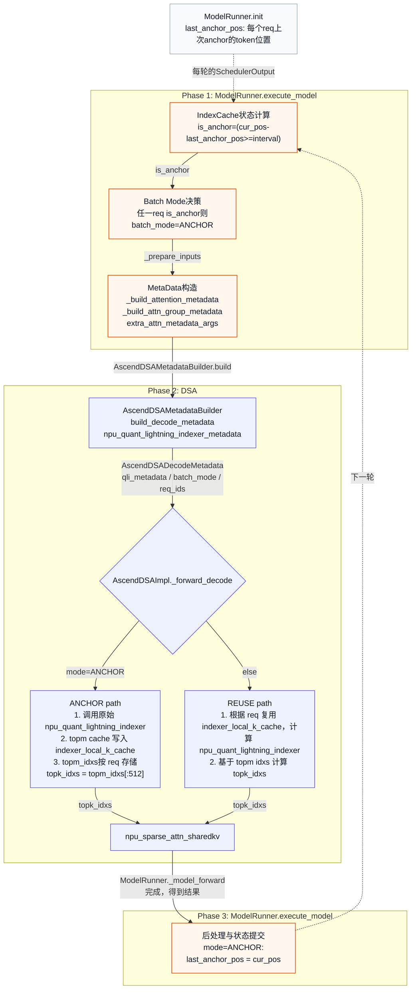

# DSA State Flow

```mermaid
flowchart TB
    classDef runner fill:#fff7ed,stroke:#ea580c,color:#111827,stroke-width:1.3px
    classDef phase fill:#f8fafc,stroke:#94a3b8,color:#111827
    classDef dsa fill:#eef2ff,stroke:#4f46e5,color:#111827

    Start["ModelRunner.init<br/>last_anchor_pos: 每个req上次anchor的token位置<br/>"]:::phase

    subgraph MR1["Phase 1: ModelRunner.execute_model"]
        direction TB
        RunnerState["IndexCache状态计算<br/>is_anchor=(cur_pos-last_anchor_pos>=interval)"]:::runner
        Decision["Batch Mode决策<br/>任一req is_anchor则batch_mode=ANCHOR"]:::runner
        Metadata["MetaData构造<br/>_build_attention_metadata<br/>_build_attn_group_metadata<br/>extra_attn_metadata_args"]:::runner
    end

    subgraph DSA["Phase 2: DSA"]
        direction TB
        DsaMeta["AscendDSAMetadataBuilder<br/>build_decode_metadata<br/>npu_quant_lightning_indexer_metadata "]:::dsa
        DsaMode{"AscendDSAImpl._forward_decode"}:::dsa
        AnchorQLI["ANCHOR path<br/>1. 调用原始 npu_quant_lightning_indexer<br/>2. topm cache 写入 indexer_local_k_cache<br/>3. topm_idxs按 req 存储<br/>topk_idxs = topm_idxs[:512]"]:::dsa
        ReuseQLI["REUSE path<br/>1. 根据 req 复用 indexer_local_k_cache，计算 npu_quant_lightning_indexer<br/>2. 基于 topm idxs 计算 topk_idxs"]:::dsa
        DsaForward["npu_sparse_attn_sharedkv"]:::dsa
    end

    subgraph MR2["Phase 3: ModelRunner.execute_model"]
        direction TB
        Commit["后处理与状态提交<br/>mode=ANCHOR:<br/>last_anchor_pos = cur_pos"]:::runner
    end

    Start -.->|每轮的SchedulerOutput| RunnerState
    RunnerState -->|is_anchor| Decision
    Decision -->|_prepare_inputs| Metadata
    Metadata -->|AscendDSAMetadataBuilder.build| DsaMeta
    DsaMeta -->|AscendDSADecodeMetadata<br/>qli_metadata / batch_mode / req_ids| DsaMode
    DsaMode -->|mode=ANCHOR| AnchorQLI
    DsaMode -->|else| ReuseQLI
    AnchorQLI -->|topk_idxs| DsaForward
    ReuseQLI -->|topk_idxs| DsaForward
    DsaForward -->|ModelRunner._model_forward完成，得到结果| Commit
    Commit -.->|下一轮| RunnerState
```
